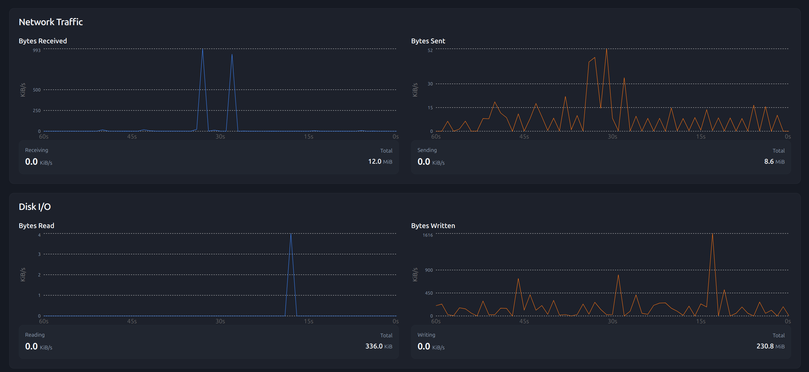

# CoreWatch

**CoreWatch** is a lightweight, real-time system monitoring tool powered by **eBPF** that tracks both **network traffic** and **disk I/O** at high precision.  
It collects metrics directly from the Linux kernel, providing accurate and low-overhead monitoring, and visualizes them in a modern, interactive web dashboard.

---

## 📌 Features

### 📡 Network Traffic Monitoring
- Tracks total bytes **received** and **sent**.
- Displays per-second rates in **KiB/s**.
- Shows total traffic over the last 60 seconds.

### 💾 Disk I/O Monitoring
- Monitors bytes **read from disk** and **written to disk**.
- Uses **block layer tracepoints** for accurate measurement.
- Graphs activity over the last 60 seconds.

### 🖥 Dashboard
- Real-time graphs for:
  - Bytes Received
  - Bytes Sent
  - Bytes Read
  - Bytes Written
- Per-second and total counters.
- Responsive UI.

---



## 🏗 Architecture

CoreWatch has two main components:

1. **eBPF Observers**
   - **Network Observer:** Hooks into `TC` to measure incoming/outgoing packets.
   - **Disk Observer:** Hooks into block layer tracepoints (`block_rq_complete`) to measure read/write bytes.

2. **Dashboard**
   - **Backend:** Python + Eventlet for WebSocket communication.
   - **Frontend:** React.js for rendering live charts.

---

## 📂 Folder Structure
COREWATCH/
│
├── frontend/ # Frontend dashboard (React.js)
│
├── observer/ # Backend & eBPF source code
│ ├── pycache/ 
│ ├── bpf/ # eBPF programs & headers
│ │ ├── common.h # Shared helper macros/functions for eBPF
│ │ ├── io_bytes.bpf.c # Disk I/O monitoring eBPF program
│ │ ├── network_monitor.bpf.c # Network monitoring eBPF program
│ │
│ ├── Makefile # Build rules for compiling eBPF programs
│ ├── metrics.log # Log file storing collected metrics
│ ├── observer.c # C code to attach/load eBPF programs
│ ├── process_data.py # Python data processing utilities
│ ├── server.py # Backend Flask + Socket.IO server
│
├── venv/ 
├── .gitignore 
├── README.md # this file
├── requirements.txt # Python dependencies

## 📋 Requirements

Before installing, make sure you have:

- **Linux Kernel ≥ 5.4** (with eBPF support)
- **Clang/LLVM** (for compiling eBPF programs)
- **bpftool** (for loading/verifying eBPF bytecode)
- **Python 3.8+**
- **Node.js + npm** (for the frontend)
- Root privileges (`sudo`) for loading eBPF programs

---

## ⚙️ Installation & Setup

### 1️⃣ Install Dependencies

```bash
# Update system packages
sudo apt update && sudo apt install -y \
    python3 python3-pip python3-venv \
    clang llvm \
    make git \
    nodejs npm
```

### 2️⃣ Install bpftool
```bash
    # Install bpftool from package manager
    sudo apt install -y bpftool

    # OR build from source (if you want latest version)
    git clone --depth 1 https://github.com/libbpf/bpftool
    cd bpftool/src
    make
    sudo make install
```

### 3️⃣ Generate vmlinux.h
```bash
    bpftool btf dump file /sys/kernel/btf/vmlinux format c > bpf/vmlinux.h

```
### 4️⃣ Install Python Dependencies
``` bash
    # Create and activate virtual environment
    python3 -m venv venv
    source venv/bin/activate

    # Install backend dependencies
    pip install -r requirements.txt
```

### 5️⃣ Start the Observer (Backend)
``` bash
    # From project root
    cd observer

    # Run the backend server
    python3 server.py
```

This will:
Load eBPF programs for network and disk monitoring
Start a WebSocket server for live data streaming

### 6️⃣ Start the Frontend Dashboard
``` bash 
    # From project root
    cd frontend

    # Install frontend dependencies
    npm install

    # Start the development server
    npm run dev
```

